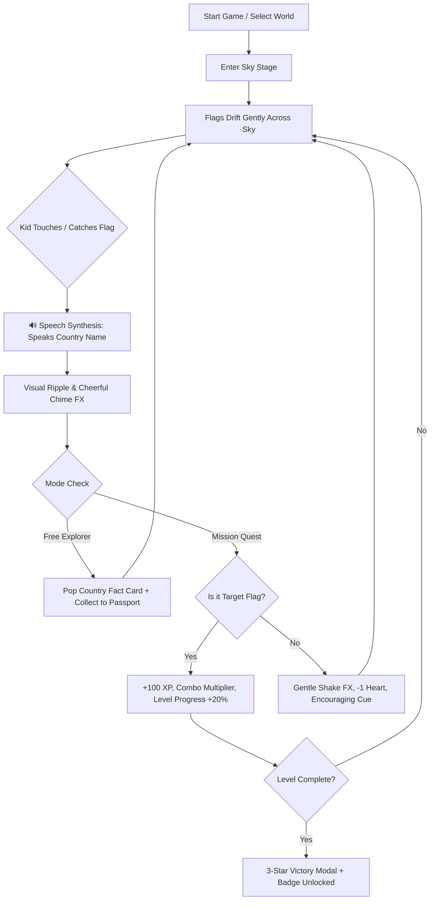
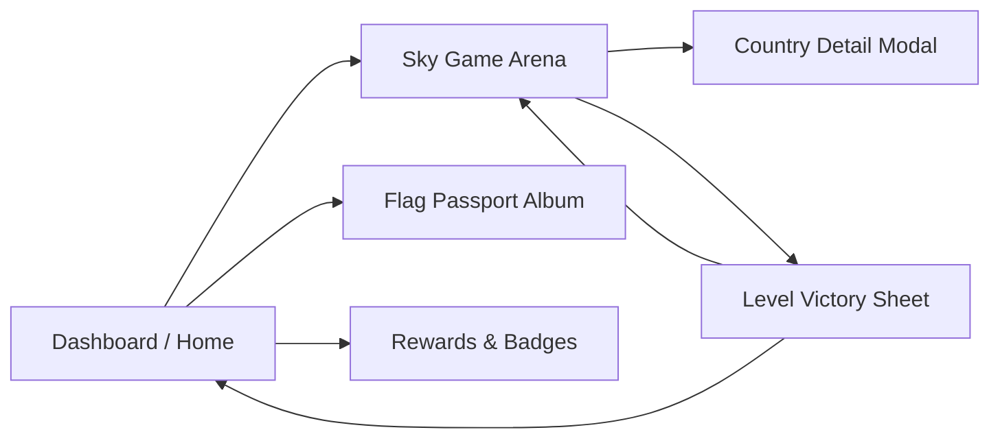

# Product Requirements Document (PRD)
## Project: Catch the Flag - Kids Educational Flying Game

**Document Version:** 1.0.0  
**Target Release:** Web & Mobile PWA  
**Target Audience:** Children ages 4–10, Parents, Educators  
**Design Reference:** [Kids Learning Game Mobile UI Kit](https://www.figma.com/community/file/1560366525230816041/kids-learning-game-ui)  
**Status:** Approved for Implementation  

---

## 1. Executive Summary & Vision

### 1.1 Vision
**"Catch the Flag"** is an interactive, multi-sensory educational game that introduces children to world geography in a playful, delightful way. Floating flags drift across an animated sky, and when kids touch or catch a flag, the game speaks the country name aloud in clear, cheerful audio, accompanied by tactile 3D micro-animations, vibrant country cards, and gamified rewards (XP, streaks, stickers, and stars).

### 1.2 Core Pillars
1. **Delightful & Squishy UI:** Faithful to the *Kids Games Mobile UI Kit*, featuring 3D pressable pill buttons, soft warm pastels, bouncy physics, cute avatars, and glossy progress indicators.
2. **Multi-Sensory Learning:** Combines visual flag recognition, clear auditory speech synthesis (Web Speech API), and tactile responsive feedback.
3. **Inclusive & Stress-Free:** Designed with zero frustration loops. Modes range from relaxed "Free Explorer" for preschoolers to exciting "Mission Quest" for elementary schoolers.
4. **Kid-Safe & Accessible:** Adheres strictly to COPPA guidelines: zero advertisements, zero tracking, zero in-app purchases, large touch targets ($\ge 48\text{px}$), and offline support.

---

## 2. Target Audience & User Personas

| Persona | Age Group | Goals & Behaviors | Game Adaptation |
| :--- | :--- | :--- | :--- |
| **Leo (The Little Explorer)** | 4 – 6 yrs | Non-reader/early reader. Loves bright colors, tapping objects, and hearing sounds. Easily frustrated by timers or losing lives. | **Free Explorer Mode**: No timers, no heart loss. Tapping any floating flag triggers instant audio pronunciation and celebratory sparkles. |
| **Maya (The Junior Adventurer)** | 7 – 9 yrs | Enjoys challenges, achievements, collecting things, and showing off high streaks. Learns country names and capitals in school. | **Mission & Continent Quest**: Prompts like *"Catch Japan!"*, combo multipliers, level badges, and filling up the Flag Passport album. |
| **Ms. Clara (Teacher / Parent)** | Adults | Looks for educational screen time that is safe, ad-free, curriculum-friendly, and engaging without overstimulating chaos. | Quick continent selection, clear audio pronunciation, offline availability, and country fact sheets. |

---

## 3. Core Gameplay Loop & Mechanics

### 3.1 Flying Flag Physics
- Flags drift gently across the sky with natural organic swaying (gentle sine-wave bobbing simulating a soft breeze).
- Float speeds are tailored by age difficulty (Slow: 1.2 px/frame for easy catching, Normal: 2.2 px/frame).
- Multiple flags appear simultaneously (3 to 6 flags on screen), staggered across vertical sky lanes to prevent overlap.
- Flags feature rounded borders (`16px`), crisp vector SVG rendering, and soft drop shadows to feel like friendly flying kites.

### 3.2 Touch & Catch Interaction
- **Direct Tap / Touch:** Tap anywhere on a flag (minimum bounding target $64 \times 48\text{px}$) to trigger the catch.
- **Pilot Avatar Follower (Optional / Interactive):** A cute mascot (Pilot Lion / Pilot Kitty) guides the player's finger or cursor with bouncy physics and cheerful expressions (smiling when correct, gasping playfully on near-misses).

### 3.3 Speech Synthesis & Audio Architecture
1. **Country Name Pronunciation:**
   - Powered by the native browser **Web Speech API** (`window.speechSynthesis`).
   - Uses child-friendly voice settings (Pitch: `1.15`, Rate: `0.9` for clarity and enthusiasm).
   - Pronunciation fallback: Every flag card includes phonetic pronunciation (e.g., *"FRANCE - [franss]"*, *"JAPAN - [juh-pan]"*).
2. **Synthesized Sound Effects (Web Audio API):**
   - No heavy external MP3 downloads required. Uses real-time synthesized audio nodes:
     - **Pop / Catch Chime:** Pentatonic marimba note (C5 - E5 - G5 - C6).
     - **Success Fanfare:** Joyful 3-chord arpeggio.
     - **Gentle Miss Cue:** Soft playful boing (no harsh buzzing).
     - **Button Tap:** Subtle bubbly click.

---

## 4. Game Modes

### 4.1 Mode 1: Free Explorer (Casual Sandbox)
- **Objective:** Discover world flags at one's own pace.
- **Rules:** No time limits, no hearts, no wrong answers.
- **Interaction:** Tap any flag to pop it up, hear its name pronounced, view its capital and continent, and automatically stamp it into the **World Flag Passport**.

### 4.2 Mode 2: Mission Quest ("Catch the Flag!")
- **Objective:** Listen to the target country prompt and catch the matching flag.
- **Prompt:** Audio voice says *"Can you find... Germany?"* while the top Mission Card displays `Catch Germany 🇩🇪`.
- **Scoring:**
  - Correct Catch: $+100$ Base XP $\times$ Combo Multiplier ($1\times, 2\times, 3\times$).
  - Wrong Catch: Hearts decrease by 1 (out of 3). Mascot gives a gentle hint: *"That was Italy! Try to find Germany!"*.
- **Win Condition:** Catch 5 target flags to complete the mission and earn 3 Gold Stars.

### 4.3 Mode 3: Continent Safari (Progressive Map)
Players travel across 6 themed worlds inspired by the Figma UI kit:
1. **World 1 - Asia Quest** (Japan, South Korea, China, India, Malaysia, Singapore, Thailand, etc.)
2. **World 2 - Europe Explorer** (France, Germany, UK, Italy, Spain, Netherlands, Sweden, etc.)
3. **World 3 - Americas Adventure** (USA, Canada, Brazil, Mexico, Argentina, Colombia, Chile, etc.)
4. **World 4 - Africa Safari** (Egypt, South Africa, Nigeria, Kenya, Morocco, Ghana, etc.)
5. **World 5 - Oceania & Islands** (Australia, New Zealand, Fiji, Samoa, etc.)
6. **World 6 - Global Champions** (Mix of all nations worldwide).

---

## 5. Gamification & Reward Systems

Faithfully adapting the elements seen in the Figma UI Kit screens:
1. **Daily Streak ($\text{Flame } 🔥$):** Displays continuous practice days (e.g., *"3 Days Streak"*), encouraging daily engagement.
2. **XP & Level Progress ($\text{Lightning } ⚡$):** Earned through missions, filling up the level XP bar.
3. **Lives System ($\text{Hearts } ❤️❤️❤️$):** 3 resilient hearts with smooth recharge and playful bounce animations.
4. **World Flag Passport (Sticker Album):**
   - Over 270 country flags to collect.
   - Collected flags appear in full vibrant color with a golden stamp; uncollected appear as friendly silhouettes.
   - Tapping any collected sticker in the album replays its audio pronunciation anytime.
5. **Achievement Badges:**
   - 🏅 *First Flight* (Caught 1st flag)
   - 🌟 *Continent Master* (Cleared all European flags)
   - 🔥 *On Fire* (Maintained a 5-catch combo)
   - 🗺️ *World Globetrotter* (Collected 50 flags)

---

## 6. Information Architecture & Screen Flow

### 6.1 Top Bar (Global Status)
- **Back / Home Button:** Chunky pill with arrow.
- **Streak Chip:** Flame icon $+ \text{count}$.
- **Hearts Chip:** 3 bouncing hearts.
- **Sound Toggle:** Speaker button with mute/unmute visual states.
- **Settings:** Audio speed, voice selector, reset game.

### 6.2 Sky Game Arena
- **Mission Prompt Pill:** Floating header card showing current mission target.
- **Sky Canvas:** Animated floating clouds, sky gradient background, drifting flags.
- **Catcher Avatar:** Mascot badge resting at bottom left/right or draggable.
- **Progress Bar:** Pill-shaped level progress with glossy gradient and star checkpoints.

### 6.3 Country Detail Modal / Bottom Sheet
- Pops up with a springy animation when a flag is caught.
- Large vector flag ($200 \times 150\text{px}$).
- Country Name in large bold friendly font (`28px`).
- Capital city, Continent tag, and fun kid fact (e.g., *"France: Home of the Eiffel Tower!"*).
- **"Listen Again" 3D Pill Button** (with speaker icon).
- **"Continue" Bright Blue 3D Button**.

### 6.4 Level Victory Sheet
- Golden Cup / Ribbon illustration.
- 3 Bouncing Animated Stars.
- XP Gained breakdown ($+300\text{ XP}$, $+50\text{ Streak Bonus}$).
- "Play Next Level" and "Back to Map" buttons.

---

## 7. Technical Requirements & Non-Functional Specs

| Requirement | Specification |
| :--- | :--- |
| **Frontend Stack** | Pure HTML5, Modern Vanilla CSS3 (Custom Properties, Flexbox, Grid), Modular ES6 JavaScript. No framework overhead. |
| **Assets Format** | 100% Vector SVG country flags (from standard ISO 3166-1 flag suite), ensuring crisp rendering on Retina / 4K displays. |
| **Audio Engine** | Browser Web Speech Synthesis API (`SpeechSynthesisUtterance`) + Web Audio API synthesizer for sound effects. |
| **Responsiveness** | Mobile-First design supporting screens from $360\text{px}$ up to $1920\text{px}+$ (smart responsive scaling with CSS `clamp()`). |
| **Performance** | Rock-solid $60\text{ FPS}$ animation loop utilizing `requestAnimationFrame` or hardware-accelerated CSS `transform`. Instant $<1\text{s}$ initial load. |
| **Data Storage** | LocalStorage for saving game score, streak, unlocked flags, and sound preferences. |
| **Kid-Friendly Safety** | Zero tracking scripts, zero external dependencies, no external font blocking, completely playable offline. |

---

## 8. Implementation Milestones

- [x] **Milestone 1:** PRD and Architecture specification finalized.
- [x] **Milestone 2:** Complete Color Profile and UI Kit extracted from Figma reference.
- [x] **Milestone 3:** Download and organize 270+ high-quality vector country flags and metadata.
- [x] **Milestone 4:** Build responsive UI layout (Sky arena, header, bottom progress bar, dialogs).
- [x] **Milestone 5:** Implement game physics, touch catch engine, and Web Speech voice synthesis.
- [x] **Milestone 6:** Integrate Flag Passport / Sticker Album and Mission Mode.
- [x] **Milestone 7:** Special Editions & UI Polish:
  - 🇲🇾 **Malaysian State Flags Edition:** 17 SVG flags (13 states and 4 federal territories) with capitals and audio pronunciation.
  - 🇺🇸 **USA State Flags Edition:** 56 SVG flags (50 states + DC + US territories) with capitals and audio pronunciation.
  - **UI Refinement:** Removed non-functional static lives and streak chips from header to keep UI crisp and focused on learning.
